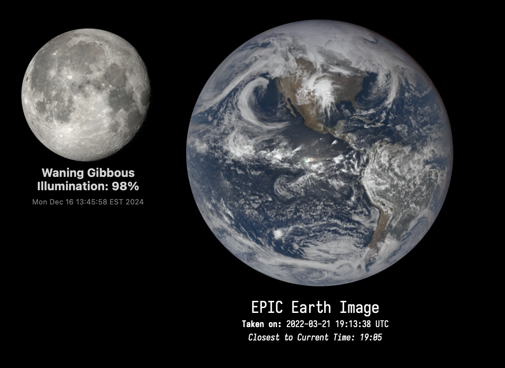

# MundoClock.widget



MundoClock is an Übersicht desktop widget that serves as both a world clock and a visual showcase of Earth, utilizing high-cadence imagery from the "High Cadence Imaging" gallery on the [EPIC website](https://epic.gsfc.nasa.gov/galleries/2022/high_cadence).

The images were captured on March 21, 2022, during the Spring Equinox. On this day, 70 high-cadence images were taken at 20-minute intervals, showing Earth's rotation and lighting conditions throughout the day.

MundoClock matches the current UTC time (HH:MM) with the closest timestamp in the dataset, displaying the image that most closely aligns with the current time. The widget refreshes every minute, updating both the displayed image and the UTC clock shown in the metadata. This allows users to compare the current UTC time with the timestamp of the image, effectively creating a semi-real-time 'clock' of Earth's rotation.

Since there are 70 images in a 24-hour period, the images change approximately every 20.57 minutes (24 hours ÷ 70 images). This interval closely reflects Earth's rotation as observed in the images.

---

## Prerequisites

### 1. Install the Iosevka Font

MundoClock uses the Iosevka font for its clean and modern aesthetic. Install it via Homebrew:

```bash
brew install font-iosevka
```

---

## Project Components

### 1. **`globe_high_cadence.jsx`**

This is the core configuration file written in JavaScript and React. It handles:

- **Time Synchronization**: Displays the current UTC time, refreshing every minute.
- **Image Selection**: Utilizes the `epic_images_index.json` file to pull the corresponding Earth image from the local directory. By parsing UTC time (HH:MM), it identifies the closest match among the 70 available images.

> **About `.jsx` Files**:
> A `.jsx` file is a JavaScript file that incorporates `JSX` (JavaScript XML), a syntax extension that makes it easier to create user interfaces. JSX allows writing HTML-like code within JavaScript, enabling intuitive structuring of UI components.

---

### 2. **`epic_images/`**

This folder houses all the high-cadence Earth images required for the widget.

---

### 3. **`epic_images_index.json`**

A JSON file containing metadata for each image in the `epic_images` directory. Each entry includes the image path and timestamp, such as:

```json
{
  "path": "MundoClock.widget/epic_images/epic_1b_20220321001338.png",
  "timestamp": "2022-03-21 00:13:38 UTC"
}
```

This file allows the widget to map UTC times to their corresponding images accurately.

---

### 4. **`high_cadence_make_list.py`**

A Python script that generates a `urls.txt` file containing the direct links to all images in the High Cadence Imaging gallery.

- **Purpose**: Automates the process of collecting image URLs from the [gallery](https://epic.gsfc.nasa.gov/galleries/2022/high_cadence).

---

### 5. **`urls.txt`**

A plain text file listing all image URLs in the gallery, created by the `high_cadence_make_list.py` script. Example:

```plaintext
https://epic.gsfc.nasa.gov/epic-galleries/2022/high_cadence/full/epic_1b_20220321001338.png
https://epic.gsfc.nasa.gov/epic-galleries/2022/high_cadence/full/epic_1b_20220321003338.png
```

> **Note**: These high-cadence images were captured on March 21, 2022, during the Spring Equinox, with a 20-minute interval between frames.

---

### 6. **`download_curl.sh`**

A shell script to download all images listed in `urls.txt`.

- **Usage**: Set the following variables to define the input file and output directory:
  ```bash
  URL_FILE="urls.txt"
  OUTPUT_DIR="downloads"
  ```
- **Details**: Includes a 2-second delay between downloads to avoid server overload.

Run it with:

```bash
bash download_curl.sh
```

---

### 7. **`make_json.sh`**

A shell script that scans the `epic_images` folder and generates the `epic_images_index.json` file. This ensures that the image metadata is up-to-date for the widget.

---

## Bringing It All Together

1. **Prepare the Images**:

   - Use `high_cadence_make_list.py` to generate `urls.txt`.
   - Run `download_curl.sh` to fetch the images.
   - Place the images in the `epic_images/` folder.
2. **Generate the Index**:

   - Execute `make_json.sh` to create the `epic_images_index.json`.
3. **Activate the Widget**:

   - Add the `MundoClock.widget` folder to Übersicht's widget directory.
   - Start Übersicht and enjoy your dynamic world clock!

---

## Acknowledgments

This widget is powered by NASA's EPIC (Earth Polychromatic Imaging Camera) images, showcasing the beauty of our planet. Special thanks to the [High Cadence Imaging](https://epic.gsfc.nasa.gov/galleries/2022/high_cadence) gallery for providing the resources that make MundoClock possible.
